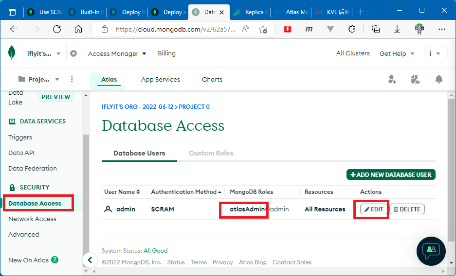
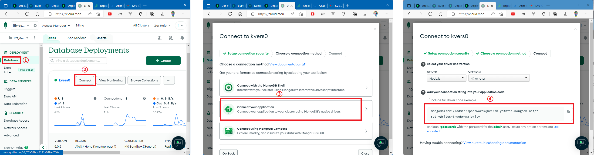

# 在 Atlas 上部署免费的 MongoDB Replica Set

## 创建 Atlas Cluster

1. 登录 [Atlas 官网](https://www.mongodb.com/atlas)
2. 注册账号
3. 创建免费的 Atlas Cluster

## 配置管理员账号

把你的管理员设置为 Build-in Role 中的 Atlas admin 角色，这允许管理员 drop databases。



## 加载初始化数据

1. 修改 Connection String

    ```ts
    // 项目根目录/packages/admin-koa/scripts/mongodb.ts
    const mongoConnectionUrl = "mongodb+srv://<管理员名称>:<管理员密码>@<集群名字>.ydfnfii.mongodb.net/?retryWrites=true&w=majority";
    
    ```
    
 2. 加载初始化数据

    ```bash
    cd packages/admin-koa
    yarn mongodb seed -d all -f   
    ```
